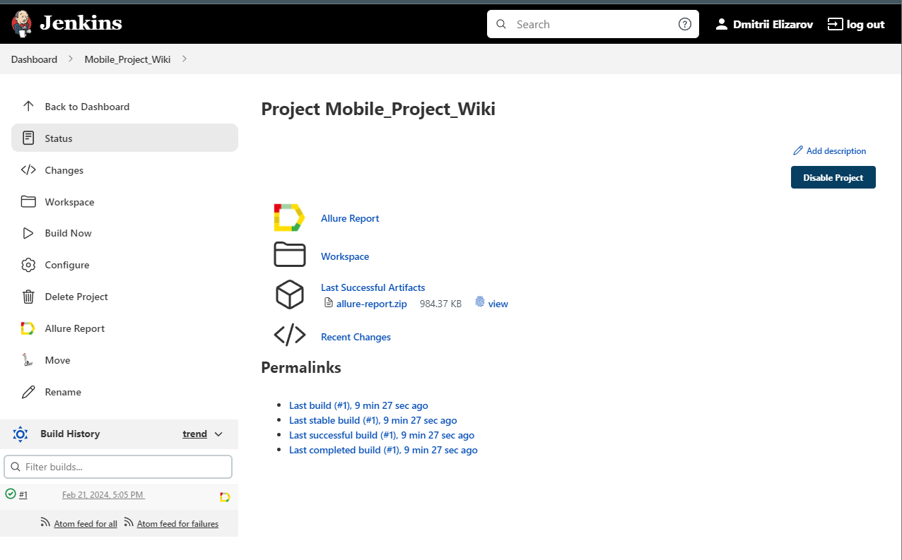
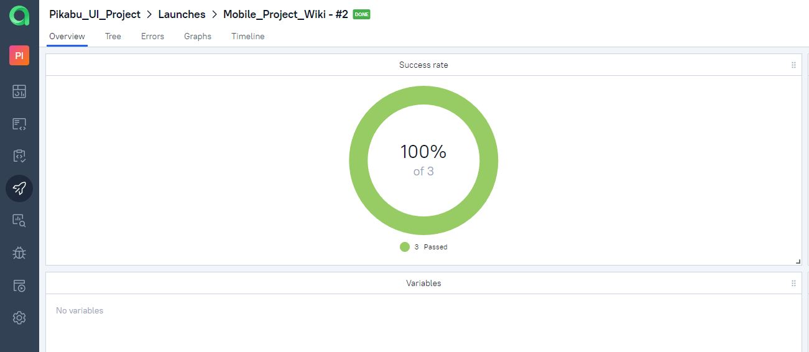
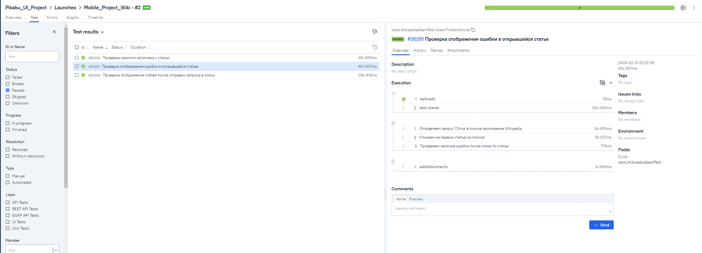
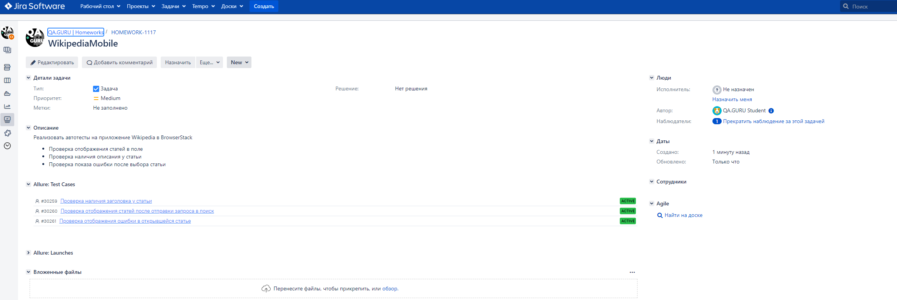
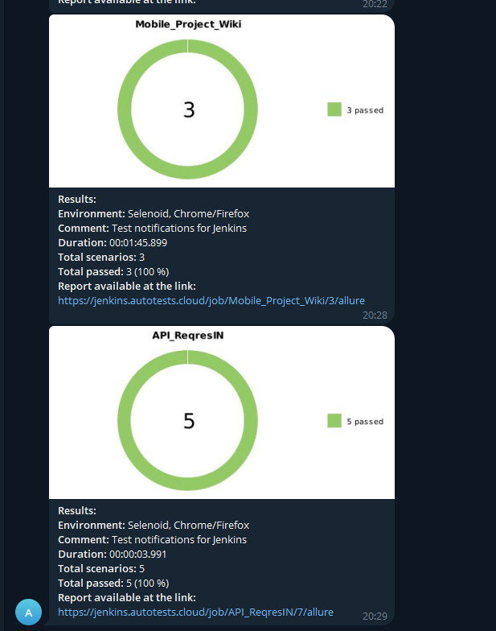
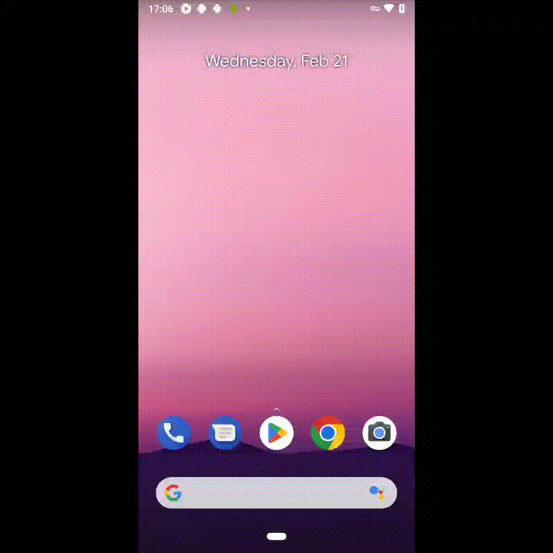

# Проект по автоматизации проверок для мобильного приложения Wikipedia


[Wikipedia](https://www.wikipedia.org/) : это общедоступная многоязычная универсальная интернет-энциклопедия со свободным контентом, реализованная на принципах вики.
## :scroll: Содержание:

- [Используемый стек](#computer-используемый-стек)
- [Список тестов проекта](#computer-список-тестов-проекта-funpay)
- [Запуск автотестов](#arrow_forward-запуск-автотестов)
- [Сборка в Jenkins](#-Автоматическая-сборка-в-Jenkins)
- [Пример Allure-отчета](#-пример-allure-отчета)
- [Интеграция с Allure TestOps](#-Allure-TestOps--обзор-результатов-проекта)
- [Интеграция с Jira](#-Jira--выведение-результатов-в-таски)
- [Уведомления в Telegram](#-Telegram--отчётность-при-помощи-бота)
- [Видео примера запуска тестов в Selenoid](#-Selenoid--Видео-прохождения-теста-в-отчете)

## :computer: Используемый стек

<p align="center">


</p>

- Язык для написания тестов : [Java](https://www.java.com/ru/)
- Фреймвокр тестирования : [Selenide](https://selenide.org/)
- Фреймворк для модульного тестирования : [Junit5](https://github.com/junit-team/junit5)
- Система автоматической сборки : [Gradle](https://github.com/gradle)
- Для использования различных браузеров в тестировании : [Selenoid](https://aerokube.com/selenoid/).
- Удаленный запуск с выбором параметров для тестов реализован при помощи :  [Jenkins](https://www.jenkins.io/)
- Отчеты о пройденных тестах формируются при помощи : [Allure](https://github.com/allure-framework)
- Так же отчеты о тестировании отправляются в мессенджер при помощи <code>Telegram</code> бота
- Реализована интеграция  с [Allure TestOps](https://qameta.io/)
- Реализована интеграция с [Jira Software](https://www.atlassian.com/software/jira)
- Тесты мобильного приложения проходят на сервисе <code>BrowserStack</code>

## :computer: Список auto-тестов мобильного приложения Wikipedia
* Проверка выдачи статей после запроса в поиске
* Проверка краткого описания стаьи
* Проверка выдачи ошибки после клика по статье


## :arrow_forward: Запуск автотестов

### Команда запуска тестов локально в IDE
* <code>gradle clean clean test  </code> : Запуск тестов в BrowserStack

### Команда запуска тестов в Jenkins
```
gradle clean
${TASK}
```

##  Автоматическая сборка в Jenkins

Для запуска сборки необходимо нажать кнопку <code>Build Now</code>.
<p align="center">

</p>
В блоке <code>Build History</code> после завершения сборки в поле с номером сборки появятся значки <code>Allure Report</code> и <code>Allure TestOps</code>, кликнув на них можно перейти в отчетность.

##  Пример Allure-отчета
### Overview

<p align="center">

</p>

##  Allure TestOps : обзор результатов проекта

На *Dashboard* в <code>TestOps</code> видна статистика тестов в общем :
* Сколько прошли успешно
* Сколько автоматизированы
* Сколько активны и не нуждаются в доработке
* Динамика успешности прохождения в течении времени

<p align="center">

</p>

### Результат выполнения автотеста

В разделе *Test Results* уже можно детально посмотреть каждый кейс, там будут расписаны шаги и результаты. Так же в этом разделе можно добавить новые кейслы на проверку или оставить комментарии уже существующим для доработки.

<p align="center">

</p>

##  Jira : выведение результатов в таски

При помощи интеграции <code>Allure TestOps</code> и <code>Jira</code>, в таску можно отобразить существующие в проекте тест-кейсы и результаты их запуска.

<p align="center">

</p>

###  Telegram : отчётность при помощи бота

После выполнения тестов созданный в <code>Telegram</code> bot собирает данные с <code>AllureReports</code> и отправляет их сообщение в нужный вам чат.

<p align="center">
 
</p>

###  BrowserStack : Видео прохождения теста в отчете

При интеграции с <code>AllureReports</code> вместе с общим результатом  тест-кейса прикладываются media файлы : скриншот и видео. Вот пример видео в отчете о завершенном тесте:
<p align="center">
  
</p>

